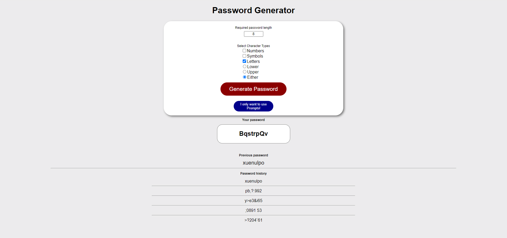

## Password Generator - Steve Barry

##  The Task

The task was to create a solution that generates a password that meets the users requirements.

### ⭐ ⭐ S.T.A.R. ⭐ ⭐

**SITUATION**

The provided user story was: 

> AS AN employee with access to sensitive data
> 
> I WANT to randomly generate a password that meets certain criteria
>
> SO THAT I can create a strong password that provides greater security

**TASK**

Provide a solution so that the user can set various criteria and be provided with a password that meets the criteria.

**ACTION**

A full review of the code, resulting in:
* Layout
  * *Layout is responsive and functional on various screen sizes*
  * *Simple, yet attractive design*
  * *Logical layout*
  * *Improved code visualisation - eg: indentation*
  * *Error free loading*
  * *Favicon designed and added*
  * *Thorough comments*
  * *Intuitive design with error handling and user feedback if mistakes made*
* Javascript
  * *Error free performance*
  * *Multiple functions to separate aspects of code*
* GIT
  * *Numerous commits to track changes in code*
  * *Code added to public repository and Github Pages for public viewing*

**RESULT**

The end code is stored on Github, and publicly available and viewable. Accessibility functionality has been added, links have been fixed, code has been optimised, and the UI exceeds 90% similarity. This result meets all requirements of the User Story and acceptance criteria:

* ~~GIVEN I need a new, secure password~~
* ~~WHEN I click the button to generate a password~~
* ~~THEN I am presented with a series of prompts for password criteria~~
* ~~WHEN prompted for password criteria~~
* ~~THEN I select which criteria to include in the password~~
* ~~WHEN prompted for the length of the password~~
* ~~THEN I choose a length of at least 8 characters and no more than 128 characters~~
* ~~WHEN asked for character types to include in the password~~
* ~~THEN I confirm whether or not to include lowercase, uppercase, numeric, and/or special characters~~
* ~~WHEN I answer each prompt~~
* ~~THEN my input should be validated and at least one character type should be selected~~
* ~~WHEN all prompts are answered~~
* ~~THEN a password is generated that matches the selected criteria~~
* ~~WHEN the password is generated~~
* ~~THEN the password is either displayed in an alert or written to the page~~

##  The Outcome

As the acceptance criteria has been met, the task is now complete.

You can view the finished product [HERE](https://nbs5000.github.io/passwordGenerator/)

Alternatively, here is a screenshot:

> 

---

Written by Steve Barry - Due date 16/12/2021

© 2021 Trilogy Education Services, LLC, a 2U, Inc. brand. Confidential and Proprietary. All Rights Reserved.

